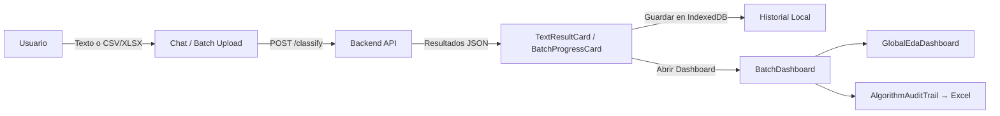

# Social Debt Frontend Model

Una interfaz de usuario moderna e interactiva para detectar, clasificar y visualizar la **Deuda Social** (_Social Debt_) en conversaciones, discusiones de código y comunidades de desarrollo de software.

Este proyecto actúa como el front-end principal para un modelo de clasificación de Deuda Social, proporcionando herramientas visuales para el análisis tanto de texto individual como de conjuntos de datos masivos (`.csv` / `.xlsx`), con dashboards avanzados, historial local persistente y soporte para clasificación en lote.

---

## ✨ Características Principales

- 💬 **Interfaz de Chat Interactiva:** Analiza comentarios de texto individualmente para detectar macrocausas, microcausas, riesgos de deuda social y _community smells_, con visualización responsiva optimizada para móvil y escritorio.
- 📊 **Procesamiento en Lote (Batch):** Sube archivos `.csv` o `.xlsx` estructurados para clasificar cientos de comentarios de forma asíncrona, con barra de progreso y cancelación en tiempo real.
- 📈 **Dashboard de Métricas EDA Global:** Visualiza distribuciones de macrocausas, Top N de microcausas, riesgos y estrategias, heatmaps de co-ocurrencias, y el Índice de Deuda Social (SDI) a nivel de issue y global.
- 🔬 **Audit Trail del Algoritmo:** Exporta un reporte Excel completo con múltiples hojas (métricas SDI, comparativa de modelos, indicadores, efectos, tipos de microcausa) para revisión académica o de equipo.
- 🗂️ **Historial Local Persistente:** Todo el historial de análisis e interacciones se guarda localmente en el navegador usando IndexedDB — sin servidor, sin telemetría, 100% privado.
- 🎨 **Diseño Premium (Glassmorphism + Responsive):** Estética moderna con modo glassmorphism, animaciones fluidas, diseño responsivo completo (Mobile & PC), y paleta de colores optimizada para legibilidad.
- 🧠 **Ontología de Deuda Social:** Diccionario de ontología integrado con más de 1,200 entradas para microcausas, estrategias preventivas/correctivas, riesgos, efectos, indicadores y métricas.

---

## 🛠️ Stack Tecnológico

| Capa | Tecnología |
|------|-----------|
| **Framework Core** | [Next.js 16](https://nextjs.org/) (App Router) + [React 19](https://react.dev/) |
| **Estilos** | [Tailwind CSS v4](https://tailwindcss.com/) |
| **Iconografía** | [Lucide React](https://lucide.dev/) |
| **Visualización** | [Recharts](https://recharts.org/) + [Nivo](https://nivo.rocks/) (Heatmaps) |
| **Procesamiento de Archivos** | [PapaParse](https://www.papaparse.com/) (CSV) + [ExcelJS](https://github.com/exceljs/exceljs) (XLSX) |
| **Animaciones** | [Framer Motion](https://www.framer.com/motion/) |
| **Almacenamiento Local** | `idb-keyval` (IndexedDB) |
| **Calidad de Código** | ESLint + TypeScript estricto |

---

## 📦 Estructura del Proyecto

```text
src/
├── app/                      # Layout y rutas principales (Next.js App Router)
├── features/
│   ├── chat-interface/       # Chat, Sidebar, Modales de validación y carga
│   ├── batch-classification/ # Lógica de clasificación en lote, progreso y acciones
│   ├── metrics-dashboard/    # Dashboard EDA global, BatchDashboard, Audit Trail
│   │   ├── BatchDashboard.tsx        # Dashboard por issue/dataset
│   │   ├── GlobalEdaDashboard.tsx    # Dashboard EDA agregado global
│   │   ├── AlgorithmAuditTrail.tsx   # Exportación Excel multi-hoja
│   │   ├── edaUtils.ts               # Cálculo de distribuciones globales
│   │   └── utils.ts                  # Utilidades de aplanado de métricas
│   ├── ontology/             # Diccionario de ontología y hooks de acceso
│   │   ├── frontend_ontology_dictionary.json  # +1200 entradas de ontología
│   │   └── useOntology.ts             # Hook con búsqueda flexible de entidades
│   └── text-classification/  # Componentes de resultado de clasificación individual
└── lib/                      # Utilidades compartidas (historyDB, etc.)
```

---

## ⚙️ Requisitos Previos

- **Node.js** 18.x o superior
- **npm** (o `yarn` / `pnpm`)
- Servidor de backend de clasificación corriendo (ver configuración de entorno)

---

## 🚀 Empezando (Getting Started)

### 1. Clonar el repositorio

```bash
git clone <url-del-repositorio>
cd social-debt-frontend-model
```

### 2. Instalar dependencias

```bash
npm install
```

### 3. Configurar variables de entorno

Crea un archivo `.env` en la raíz del proyecto:

```env
NEXT_PUBLIC_API_URL=http://localhost:8000/api/v1
API_SECRET_KEY=tu_clave_secreta
```

> ⚠️ El archivo `.env` **no debe commitearse**. Asegúrate de tenerlo en `.gitignore`.

### 4. Iniciar el servidor de desarrollo

```bash
npm run dev
```

### 5. Abrir en el navegador

Navega a [http://localhost:3000](http://localhost:3000).

---

## 📜 Scripts Disponibles

```bash
npm run dev      # Modo desarrollo con hot-reload
npm run build    # Compilación de producción optimizada
npm run start    # Servidor de producción (requiere build previo)
npm run lint     # Análisis estático con ESLint (0 errores tolerados)
```

---

## 🗺️ Flujo de Uso



---

## 📄 Licencia

Este proyecto es parte de una investigación académica sobre Deuda Social en comunidades de software. Todos los derechos reservados.
